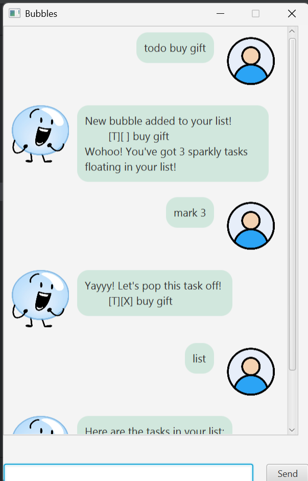

# Bubbles User Guide



### Welcome to Bubbles!
Your all-in-one assistant to help you tackle every task you've got planned ahead! Whether you're organizing your day, managing projects, or just trying to stay on top of life, **Bubbles** is here to make it smoother, smarter, and a lot more fun.

## Adding todos
Creates a simple task without any associated date or time. This is perfect for tasks that don’t need scheduling.

Example: `todo shopping`

```
New bubble added to your list!
    [T][ ] shopping
Wohoo! You've got 5 sparkly tasks floating in your list!
```

## Adding deadlines

Creates a new task with a specific deadline. The task will be added to your task list and stored persistently. If the date format is invalid, the task will not be added and an error message will be shown.

Example: `deadline project /by 2025-12-10 23:59`

```
New bubble added to your list!
    [D][ ] project (by: Dec 10 2025 11:59 pm)
Wohoo! You've got 7 sparkly tasks floating in your list!
```
## Adding events
Creates a task that spans a specific time range. This is ideal for meetings, appointments, or any activity with a start and end time. The task will be added to your list and stored persistently.

Example: `event conference /from 2025-09-17 17:00 /to 2025-09-17 19:00`

```
New bubble added to your list!
    [E][ ] conference (from: Sep 17 2025 05:00 PM to: Sep 17 2025 07:00 PM)
Wohoo! You've got 7 sparkly tasks floating in your list!
```
## Deleting tasks
Removes a task from your list permanently. This is useful for clearing completed, irrelevant, or mistakenly added tasks. Once deleted, the task cannot be recovered.

Example: `delete 3`
```
Poof! The task has drifted off from your list!
    [E][X] meeting (from: Dec 12 2025 12:30 pm to: Dec 12 2025 01:00 pm)
Juss 7 more tasks waiting to drift away!
```

## Marking tasks as done
Marks a task as completed. This updates the task’s status icon from [ ] to [X].

Example: `mark 3`
```
Yayyy! Let's pop this task off!
    [D][X] report (by: Sep 23 2026 11:23 pm)
```
## Unmarking tasks
Reverts a completed task back to incomplete. The status icon changes from [X] to [ ].

Example: `unmark 3`
```
Okieee! Let's bubble it back in!
    [D][ ] report (by: Sep 23 2026 11:23 pm)
```
## Listing tasks
Displays all tasks currently in your list, including their type, completion status, and any associated date or time. This helps you keep track of what’s pending and what’s scheduled.

Example: `list`
```
Here are the tasks in your list:
    1. [E][ ] meeting (from: Dec 12 2025 12:12 pm to: Nov 12 2025 11:12 pm)
    2. [D][ ] project (by: Dec 10 2025 11:59 pm)
    3. [T][ ] shopping
```

## Finding tasks
Searches your task list for keywords and returns matching tasks. This helps you quickly locate specific items without scrolling through the entire list.

Example: `find shopping`
```
Here are the bubbles that match:
    1. [T][ ] shopping
```